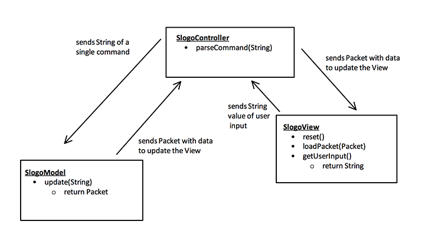
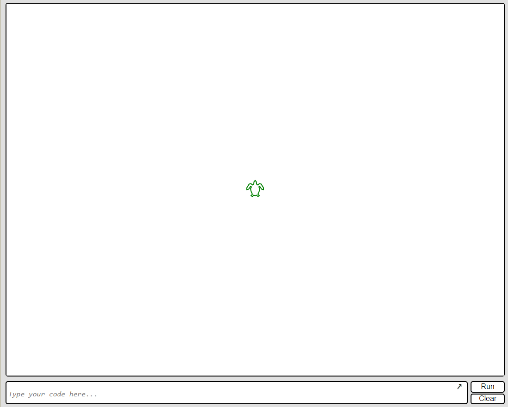

SLogo : Design Document
===================

Introduction
-------------------
In this project, our group is developing a simplified version of a robot-control based language, in designing a simulative environment that allows you to control a "turtle" with commands as you would in Logo, but with its code architecture in Java.
The primary design goals of this project are to create a dynamic, flexible back-end support that can properly accept and respond to a variety of commands, while having a dynamic and synchronized front-end that updates those back-end changes in real-time. Our design allows for the most flexibility when it comes to controller integration, capable of 
processing invalid and valid requests of all kinds, while providing the correct response to the front-end display for the user. The primary architecture of the design is to have a front-end view that highlights the "turtle", as well as an input box that sends packages throughout our system as commands for the robot. After the data packages are processed,
the controller updates the back-end model and front-end display, allowing the user to see the responses towards their commands.

Overview
-------------------

**Overall:**

Our SLogo team environment will be based on the Mediator design pattern, where a Mediator will manage the communication between the graphics and the model.  
For the overall design of SLogo Application we decided to use the Mediator design pattern. With the Mediator design pattern the graphics side of the application will communicate to the mediator, which will then communicate to the model. In this set up, the model and the graphics will not directly communicate.

**General Data Structures & Classes:**  
Our application will be based on three main classes: *SLogoController*, *SLogoView*, and *SLogoLogic*.  
The SLogoController class will be the mediator, the SLogoView class will contain the graphics, and the SLogoLogic class will contain the model. The Main class will first create a new SLogoController, which will then create and maintain references to SLogoLogic and the SLogoView objects.
 **General Methods & Processes:**  
After initializing the SLogoLogic and the SLogoView objects, the SLogoController will create a listener that waiting for the user to input a command for the turtle. Specifically, the SLogoController class will be listening to the SLogoView class, which will send out  a “user entered input” signal to the SLogoController. The SLogoController will then ask the SLogoView for the raw command input in the form of a String, then parse out the specific command from that input or throw an error if the input was invalid. Valid commands would then be sent to the SLogoLogic class. After the SLogoLogic processes the commands, it will send a Packet object containing the methods that were executed back to the SLogoController class. The Packet class will be used to encapsulate data to be sent between the three core classes. A Packet object could contain a list of previously executed commands that the SLogoView class needs to display, an error that is thrown either in the SLogoController class or the SLogoLogic class, or any other information that needs to be transported between the three main classes. Once the Packet object is returned to the SLogoController, it is then passed to the SLogoView. The SLogoView then peeks into the packet and then renders that information onto the view. This could either be in the case of an error pop up that displaces a message from a packet or the case of animating a forward command.

User Interface
-------------------
**How will the user interact with the program?** 
Initially, the user will have a text-input box to type in general commands, as defined in the help manual and Logo language. From that language input, the program will process and ensure that the turtle moves with the proper response. In addition, the program will keep a log of 
recent commands, and have an on-click feature that gives users the capability to run user commands without manually typing in anything, and can issue commands with clicks rather than completely text.  
**Overall Appearance**  
The overall appearance will have an input text box for user type, a big window with a turtle in the middle (background-color white), as well as a combobox dropdown menu with options for previous commands. For future enhancements, we will likely add on to this but for the basic implementation, we don't need much else.
Erroneous situations will be highlighted in red above the text box, with text corresponding to the error (e.g, Cannot find command, or invalid request).

API Details
-------------------
**Main Class**
- Handles Specific Features: Launches Slogo Project
- Justify Creation: Need an entrypoint to the program to boot

**SlogoController**
- Passes information back and forth between SlogoView and SlogoLogic 
- Has a parse() method which takes a raw String (command) from SlogoView, parses it, and sends a single command to SlogoController in the form of a String.
- Takes a data Packet from SlogoLogic and sends it to SlogoView so it can be rendered to the screen

**SlogoLogic**
- Has a command update(String) which takes a command in the form of a String, performs the command, and returns the results/data in a Packet object. 

**SlogoView**
- reset() method to clear the view and command history
- getUserIntput() method returns the String that the user typed (or selected from previous history or combo box)
- loadPacket(Packet) method receives a Packet of data, and from this data, it renders the result/moves the turtle on the screen

**Description**
The SlogoController's primary purpose is to parse commands and pass information back and forth between the View and Model. It will instantiate SlogoLogic and SlogoView objects, and call their public methods to facilitate the passing of information. When a user types in a command, the SlogoController will call the SlogoView's getUserInput() method to retrieve the String. It will parse the command, check for errors, and if the String contains multiple commands, it will break them up into Strings of single commands. It will pass each command to the model by calling the SlogoLogic's update(String) method and pass the command as a parameter. The SlogoLogic will perform the command and return a Packet of information to the SlogoController. The SlogoController will then call the SlogoView's loadPacket(Packet) method, which will use the data in the Packet to update the view. 
There are different types of Packets for different types of commands. Packets for the result of mathematical operations will simply be numbers, while packets for the result of turtle commands will contain more information (e.g., new position).

We designed our application this way because the Packets provide a lot of flexibility. There are different types of Packets, so if new types of commands were added, we could add a new type of packet and add logic to handle those commands without changing the structure of already existing code. Also with Packets, the data is nicely contained in one object, so it is easy to see where the data dependencies are. Having separate classes for the model, view, and controller allows us to add features or change implementation of one part without affecting the other.

API Example Code
-------------------
**use case 1: fd 50**

- SlogoController calls the following methods:
- command String = SlogoView.getUserIntput() 
- command = parse(command String) 
- packet = SlogoLogic.update(command)
- SlogoView.loadPacket(packet)

**use case 2: sum 10 random 20**
- SlogoController calls the following methods:
- command String = SlogoView.getUserIntput() 
- parse(command String) 
- currentCommand = random 20
- SlogoLogic.update(currentCommand)
- currentCommand = sum 10 (output of random 20)
- packet = SlogoLogic.update(currentCommand)
- SlogoView.loadPacket(packet)

**use case 3:  command with wrong syntax**

- SlogoController calls the following methods:
- command String = SlogoView.getUserIntput() 
- command = parse(command String) 
- packet = error message from parse(command String)
- SlogoView.loadPacket(packet)

**use case 4:  logical incorrect command (quotient 5 0)**

- SlogoController calls the following methods:
- command String = SlogoView.getUserIntput() 
- command = parse(command String) 
- SlogoLogic.update(command)
- packet = error message from update function
- SlogoView.loadPacket(packet)

Design Considerations
-------------------
We planned out the majority of the basic implementation, with only a few issues remaining up for debate. We still weren't sure how we were going to format the response package data from the back-end to the front-end, in the sense that we haven't decided if we are going to implement a 
String or a Package (of data) object. In terms of unclear implementations, we weren't too sure as to what the combobox instructions were going to entail, and how we were expected to respond to clicks on the boxes or real-time command updates. Other than that, we discussed the mechanisms and general
APIs that would be present for the program, and how we would transfer data to each parts of the project. We eventually decided on a package based transfer system, with error codes and data being transferred in these packages. Moving the turtle would also come from commands executed by the controller, in response
to packages decoded from the input-text box in the front-end display.

Team Responsibilities
-------------------
Aaron: Backend design  
Ryan: Frontend design  
Yuming: Backend design  
Brian: Frontend design  
 
**Implementation** 
We plan on coordinating how the front-end and back-end will talk to each other, with the back-end completing their infrastructure first such that the front-end can establish the proper UI responses to those changes. One of each person from back-end and front-end will likely spend most of their efforts on
integrating the two components together, such that the interaction is smooth and bug-free.

Adding New Features
--------------------
*  New Command: In order to add a new command, you simply need to create a new class in the commands folder. It should extend the Command abstract class so it has all the methods that the Parser needs. If it is a turtle command, it should extend one of the TurtleCommand super classes and implement the executeOnTurtle method. Otherwise, it should implement the execute() method.
*  New environment/turtle property:  In order to add a new property to the environment (e.g., background color, pen color), there should be a button or some UI feature to trigger the change. This change should issue a command to the backend to modify the property. This property should be observable, so that you can create a change listener for this property in the SLogoController. This change listener should call some method in the front end which updates the view of this property. The method that the change listener calls must pass the TurtleID for the turtle you want to effect. This would require a HashMap<Integer,T> to be created somewhere in the front end, where the Integer is the TurtleID and the T is the current value for that turtle.

Major Design Choices and Tradeoffs
-----------------------------------
*  MVC: The model-view-controller design definitely made the most sense for this project.  Using this principle, we were able to easily separate the front end and the back end.  The communication between these two sections consisted entirely of packets and change listeners, which made our external APIs very simple. The drawback is that we have a lot going on in the Controller. It is responsible for a lot of work, so it is fairly long (around 300 lines) but it is not too complicated because the bulk of it is change listeners.
*  No composite design pattern: We discussed in class how it might be useful to use a composite design pattern for implementing multiple turtles. I originally wanted to use this pattern, but realized that it is not the best option. Using the composite pattern would require me to move most of the logic for updating turtle properties from the Command classes to the turtle class. I decided not do this for two reasons. First, this would require me to go back and re-arrange a lot of code. But more importantly, I think it made more sense to keep the logic within the command classes, and keep the turtle class simple. The turtle class should only be responsible for getters and setters for its properties, while the commands should do the work.
* Binding the TurtleView to the Turtle model: Binding the TurtleView directly to the Turtle model made the updating of the view side of the environment exponentially simpler. Advantages of binding the Turtle and the TurtleView include: less code needed to be altered on the view side of the environment when the environment allowed for multiple turtle and The SLogoView does not need to process the incoming commands (as it would under the initial packet passing design), instead it would only require a method to add a turtle to the view. On the other hand, binding the Turtle and the Turtle instead of feeding a list of executed commands to the view, makes undoing and reversing certain actions more difficult. Also by binding the Turtle and the TurtleView, we assumed that all updates to heading and position would be treated the same. This forced us to break up turns on the back end into multiple calls of turns less than 180 degrees to ensure the turtle turned in the correct direction. Also, the "home" command animates the turn returning home instead of directly moving there. By not passing the type of command to the view, it makes it more difficult to have different behaviors between similar commands. The trade off is instead of implementing the visual behavior for each command, binding the turtle and the TurtleView assumes for general behavior for all the commands.

Assumptions
-----------
*  AskWith command: I assumed that this is only testing the conditions for the currently active turtles, not all turtles in the environment

